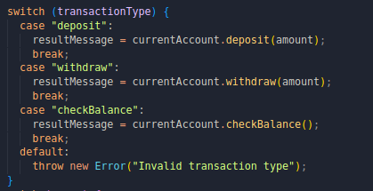
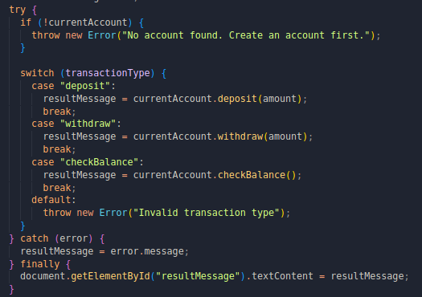

# Bank Account Management System

## Introduction

During the development of this bank management system, I skillfully integrated fundamental Javascript concepts, mainly classes, try-catch-finally statements and switch statements. They together enhance functionality of my application.

## Core concepts

### Javascript Classes

Among the major components of the project is the BankAccount class, which encapsulates the behavior and properties of bank account such as account holder, account type and the account balance.
When new user creates an account, a new instance of BankAccount class is instaniated.

#### Class Constructor

### Switch Statement

User actions on the management system are facilitated by switch statements. These actions are depositing and withdrawing funds and checking balances.This enables routing of user input efficiently to the corresponding functions within the try-catch-finally block.

#### Switch Statement

### Exception handling with try-catch-finally

This has helped me adeptly manage exceptions that may arise during the execution of transactions, such as invalid inputs or insufficient funds. Occured exceptions are gracefully communicated to the user while maintaining consistency of the application's state.

#### try-catch-finally instance

## Conclusion

In this write-up, I have gone through how I have integrated classes, switch statements and try-catch-finally statement into the bank management suystem website. The three concepts collectively contribute to the website's functionality.
